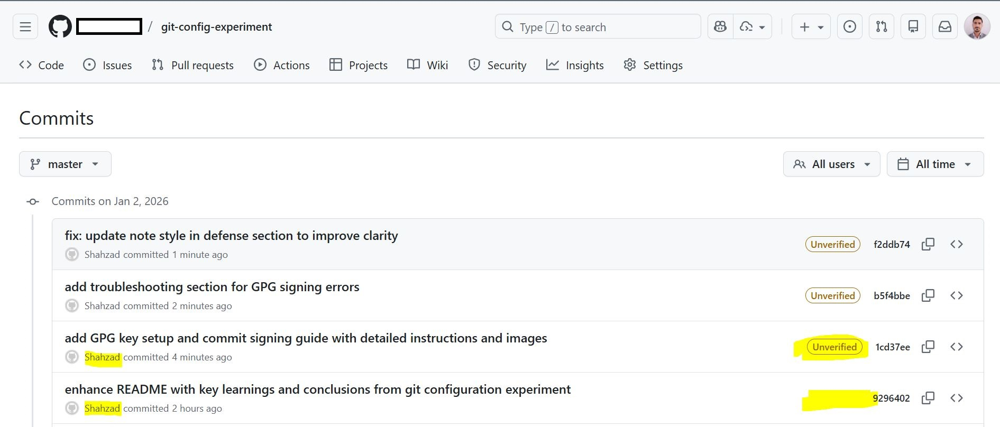
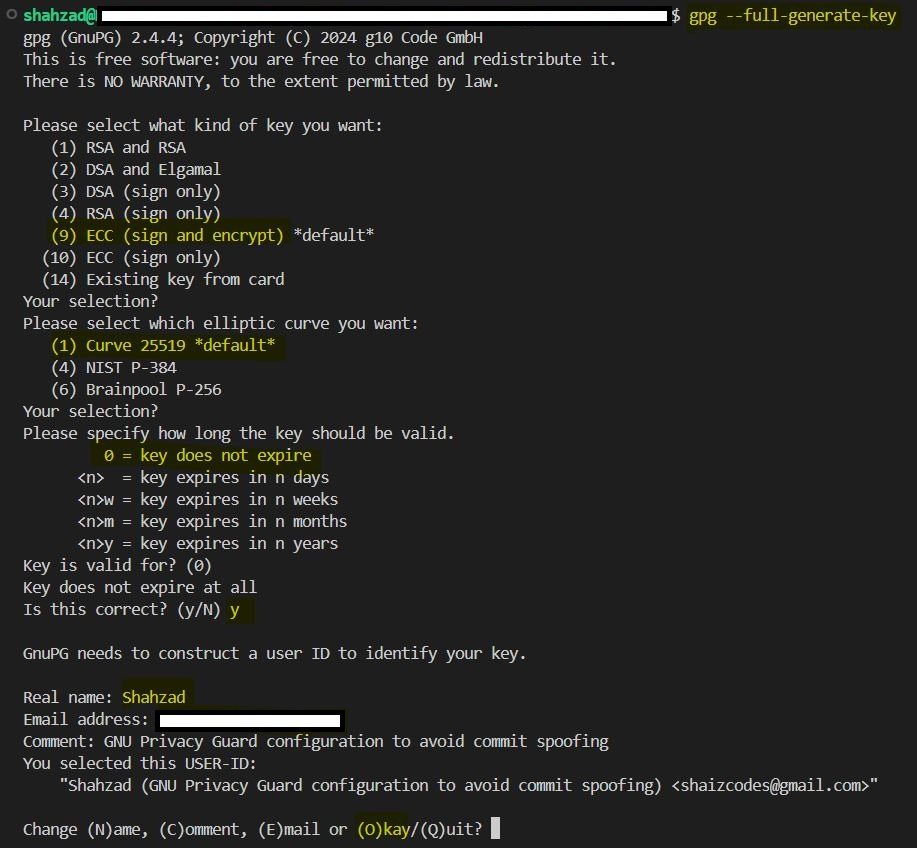
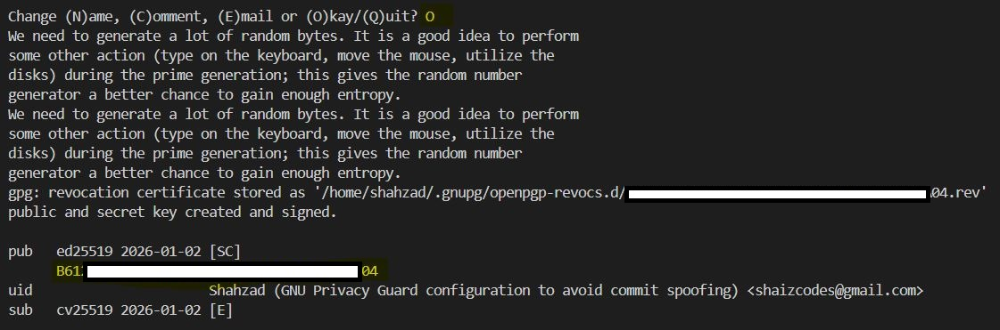
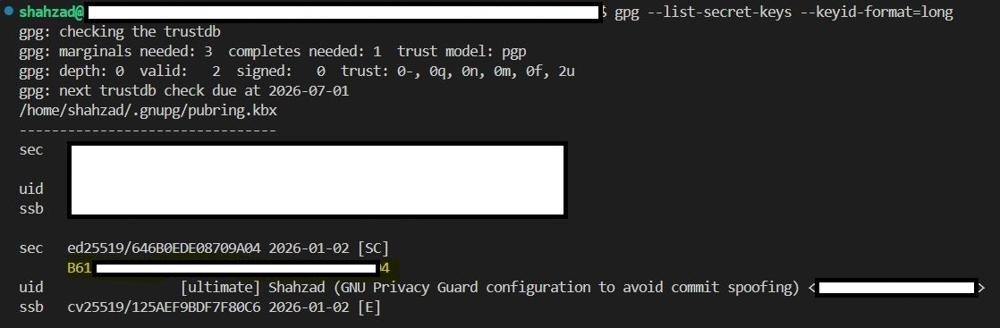
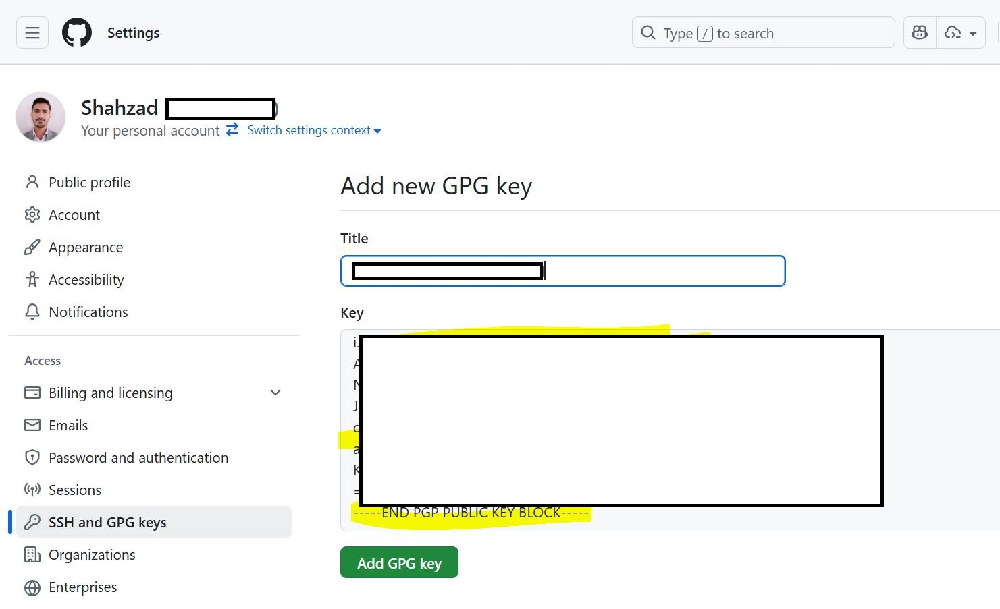

# GPG Key Setup & Commit Signing Guide

This guide provides detailed instructions for setting up GPG (GNU Privacy Guard) for signing your Git commits. GPG signing cryptographically proves that you made a commit and prevents identity spoofing.

## Table of Contents

- [What is GPG Signing?](#what-is-gpg-signing)
- [Why GPG Matters](#why-gpg-matters)
- [Step-by-Step Setup](#step-by-step-setup)
  - [1. Generate a GPG Key](#1-generate-a-gpg-key)
  - [2. List Your Keys](#2-list-your-keys)
  - [3. Configure Git](#3-configure-git)
  - [4. Add Public Key to GitHub](#4-add-public-key-to-github)
  - [5. Verify Your Setup](#5-verify-your-setup)
- [Signing Commits](#signing-commits)
- [Troubleshooting](#troubleshooting)
- [References](#references)

## What is GPG Signing?

GPG (GNU Privacy Guard) is a free implementation of the OpenPGP standard. When signing commits:

- Your **private key** (secret, only on your machine) signs the commit
- Your **public key** (registered with GitHub) verifies the signature
- GitHub marks verified commits with a ✓ badge

## Why GPG Matters

> [!IMPORTANT]
> **GPG is the Real Defense Against Identity Spoofing**
>
> Without GPG signing:
> - Anyone can change their local git config to any email
> - GitHub only checks if the email matches a registered account
> - Identity relies on a configuration file
>
> With GPG signing:
> - Only your private key can create valid signatures
> - Even with a faked email, the signature proves your identity
> - GitHub verifies cryptographic ownership, not just email matching



*Example of unverified commits - notice the "Unverified" badge indicating these commits lack cryptographic proof of authorship.*

## Step-by-Step Setup

### 1. Generate a GPG Key

Generate a new GPG key pair:

```bash
gpg --full-generate-key
```

This will prompt you through an interactive wizard:

1. **Select key type**: Press Enter to accept the default (RSA and RSA)
2. **Key size**: Enter `4096` for a strong key
3. **Expiration**: Press Enter for no expiration, or specify years (e.g., `1y`)
4. **Confirm**: Type `y` to confirm
5. **Real name**: Enter your full name
6. **Email address**: Enter the email associated with your GitHub account (**important!**)
7. **Comment**: Optional, you can skip this
8. **Passphrase**: Create a strong passphrase to protect your key



> [!NOTE]
> The email address you use here **must match your GitHub primary email address** for GitHub to recognize and verify your commits.

After successful generation, you should see confirmation:



### 2. List Your Keys

Find your key ID after generation:

```bash
gpg --list-secret-keys --keyid-format=long
```

Output will look like:

```
/home/user/.gnupg/pubring.kbx
------------------------------
sec   rsa4096/ABC123DEF456GHIJ 2024-01-02 [SC] [expires: 2025-01-02]
      1234567890ABCDEF1234567890ABCDEF12345678
uid                 [ultimate] Your Name <your.email@github.com>
ssb   rsa4096/XYZ789UVW123KLMN 2024-01-02 [E]
```

Your **key ID** is the part after the slash: `ABC123DEF456GHIJ` in above output.



In the above picture, the highlighted text is the full fingerprint key.

### 3. Configure Git

Configure Git to use your GPG key:

```bash
# Set your signing key (replace with your actual key ID)
git config --global user.signingkey REPLACE_ME_WITH_KEY

# Enable automatic signing for all commits
git config --global commit.gpgSign true
```

Verify your configuration:

```bash
git config --global user.signingkey
git config --global commit.gpgSign
```


In this picture, I used the full fingerprint key.

### 4. Add Public Key to GitHub

Export your public key:

```bash
gpg --armor --export REPLACE_ME_WITH_KEY
```

This outputs your public key in ASCII armor format. Copy the entire output including the `-----BEGIN` and `-----END` lines.


Then add it to GitHub:

1. Go to [GitHub Settings → SSH and GPG keys](https://github.com/settings/keys)
2. Click **New GPG key**
3. Paste your public key containing both the `-----BEGIN` and `-----END` lines.
4. Click **Add GPG key**
5. Confirm with your GitHub password



> [!TIP]
> You can add multiple GPG keys to your GitHub account. If you use multiple machines, generate a key on each and add them all.

### 5. Verify Your Setup

Make a test commit:

```bash
git log --show-signature
```

You should see output like:

```
commit abc123def456 (HEAD -> main)
gpg: Signature made Wed Jan 02 10:30:00 2024 UTC
gpg: Good signature from "Your Name <your.email@github.com>"
Author: Your Name <your.email@github.com>
Date:   Wed Jan 02 10:30:00 2024 +0000

    Test commit message
```

After pushing to GitHub, your commit should display the green **"Verified"** badge:


*Success! The green "Verified" badge confirms your commit is cryptographically signed and authenticated.*

## Signing Commits

Once GPG is configured, all commits will be automatically signed if you enabled `commit.gpgSign true`.

To verify a commit was signed:

```bash
# View signature information
git log --show-signature

# View detailed signature info
git log --pretty=fuller --show-signature

# Verify a specific commit
git verify-commit <commit-hash>
```

## Troubleshooting

### "gpg: signing failed: Inappropriate ioctl for device"

This error occurs when GPG can't prompt for your passphrase. 

**Quick fix:**
```bash
export GPG_TTY=$(tty)
```

**Permanent fix** - Add to your `~/.bashrc` or `~/.zshrc`:
```bash
echo 'export GPG_TTY=$(tty)' >> ~/.bashrc
source ~/.bashrc
```

This tells GPG which terminal to use for passphrase prompts.

### "gpg: signing failed: No secret key"

This means your GPG key isn't properly configured:

1. Verify your key exists: `gpg --list-secret-keys`
2. Check your git config: `git config --global user.signingkey`
3. Make sure the key ID matches exactly (case-sensitive)

### "gpg: skipped: Unusable secret key"

Your GPG key might be:
- Expired
- Revoked
- On a different keyring

Solution: Generate a new key or update the expiration date

### Passphrase not being remembered

Git should cache your passphrase, but if it keeps asking:

1. Install `gpg-agent` (usually included with GPG)
2. Add to your `~/.bashrc` or `~/.zshrc`:
   ```bash
   export GPG_TTY=$(tty)
   ```

### Key doesn't match on GitHub

The most common issue:

1. The email in your GPG key must match your GitHub primary email
2. The key ID in git config must be correct
3. The public key must be added to GitHub

## References

- **[GitHub: Generating a new GPG key](https://docs.github.com/en/authentication/managing-commit-signature-verification/generating-a-new-gpg-key)** - Official guide
- **[GitHub: Adding a GPG key](https://docs.github.com/en/authentication/managing-commit-signature-verification/adding-a-gpg-key-to-your-github-account)** - Adding to GitHub account
- **[GitHub: Signing commits](https://docs.github.com/en/authentication/managing-commit-signature-verification/signing-commits)** - How to sign commits
- **[GitHub: About commit signature verification](https://docs.github.com/en/authentication/managing-commit-signature-verification/about-commit-signature-verification)** - Overview of verification
- **[GPG Official Documentation](https://gnupg.org/)** - GNU Privacy Guard documentation
