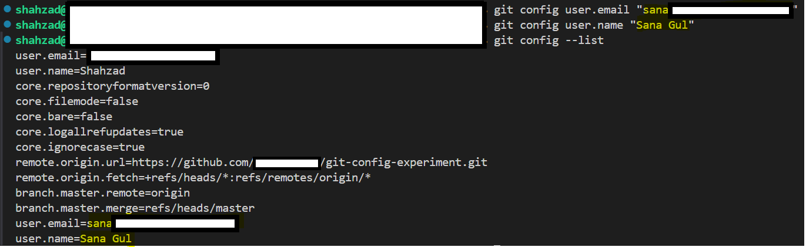
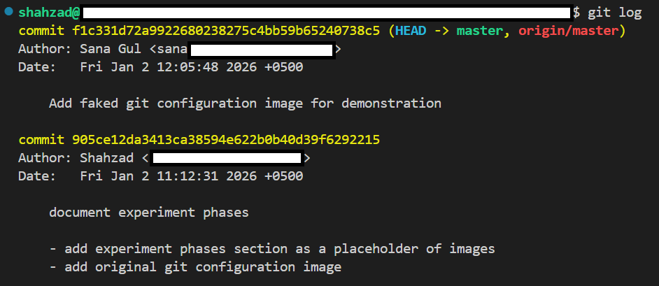
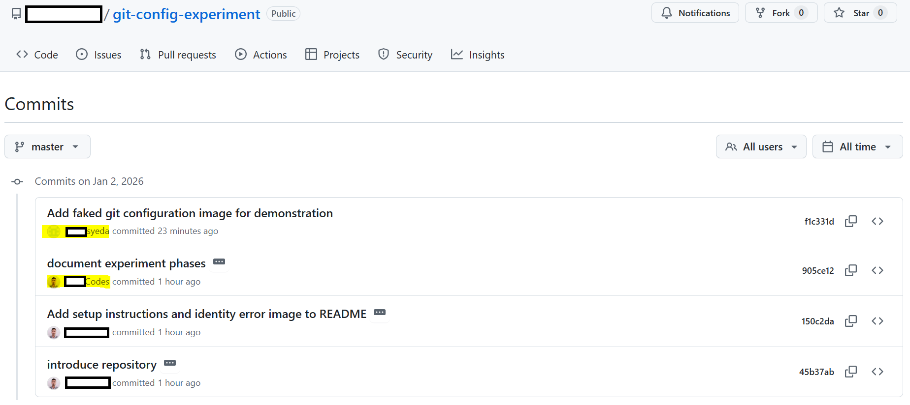
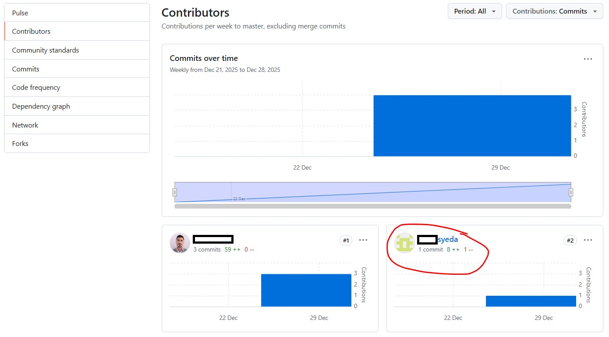
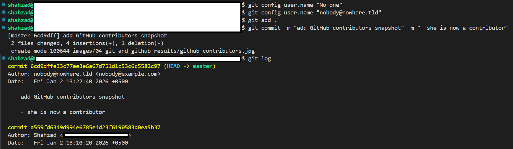
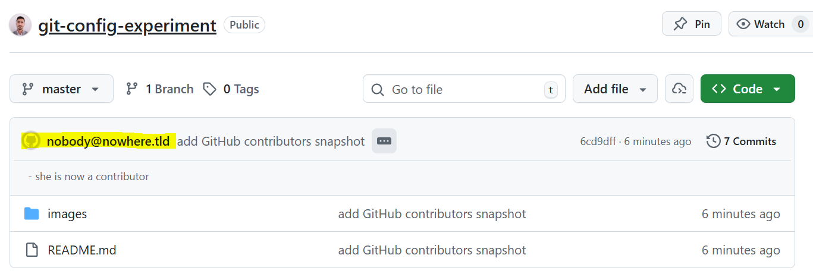

# Git Configuration Experiment

A simple experiment out of curiosity to see what happens when you commit with different git user configurations and then push to GitHub.

## Table of Contents

- [Project Structure](#project-structure)
- [Experiment Flow](#experiment-flow)
- [Setup](#setup)
- [Experiment Documentation](#experiment-documentation)
  - [Phase 2: Original Credentials](#phase-2-original-credentials)
  - [Phase 3: Different Credentials](#phase-3-different-credentials)
  - [Phase 4: Git and GitHub Results](#phase-4-git-and-github-results)
    - [git log results](#git-log-results)
    - [GitHub Commits History](#github-commits-history)
    - [GitHub Contributors](#github-contributors)
    - [Non-existent Git User Configuration](#non-existent-git-user-configuration)
    - [Non-existent GitHub User Commit](#non-existent-github-user-commit)
- [Conclusion](#conclusion)
  - [Key Learnings](#key-learnings)
  - [Possible Consequences](#possible-consequences)
  - [Defense & Best Practices](#defense--best-practices)
- [References](#references)

## Project Structure

```
/
├── README.md
└── images/
    ├── 01-initial-setup/             # Screenshots before any commits
    ├── 02-original-credentials/      # After commits with my original git config
    ├── 03-different-credentials/     # After commits with different git config
    └── 04-git-and-github-results/    # Screenshots showing contributors and commits
```

## Experiment Flow

1. Add initial screenshots (before any commits)
2. Set git configuration to my original credentials and make some commits
3. Change git configuration to someone else's credentials and make more commits
4. Change git configuration back to my original credentials and make final commits
5. Push all commits to GitHub
6. Screenshot the GitHub repository to see how contributors and commits are attributed


## Setup

Before making commits, configure git with your credentials:

```bash
git config --global user.email "your@example.com"
git config --global user.name "Your Name"
```

If you get an error about empty ident, run the commands above to set your identity:


## Experiment Documentation

### Phase 2: Original Credentials

Configuration set to my actual credentials:


### Phase 3: Different Credentials

Configuration set to someone else' credentials:

> [!NOTE]
> I have taken her consent for this experimentation, and this work is just for educational cause.



### Phase 4: Git and GitHub Results

#### git log results



> Local Git repository shows her contribution.

#### GitHub Commits History



> GitHub shows her commit with her clickable profile (though, it was I who did that commit, not her actually.)

#### GitHub Contributors



> She can be seen among the GitHub repository contributors.

#### Non-existent Git User Configuration



#### Non-existent GitHub User Commit



> GitHub shows the email of the user who does not have GitHub profile, and therefore the profile is not clickable/navigable.

## Conclusion

### Key Learnings

> [!IMPORTANT]
> This experiment reveals critical differences between local Git configuration and GitHub's user attribution system:
>
> **Findings:**
> - Existent GitHub user with matching email → Appears as contributor with clickable profile
> - Non-existent user with fake credentials → Commits visible, but no profile link
> - **Identity is based on local configuration file anyone can change**
>
> **Key Insight:** Git trusts the local configuration, but GitHub trusts the email-to-account mapping.

### Possible Consequences

> [!WARNING]
> **Security & Attribution Risks**
> - **Identity Spoofing**: Anyone can attribute commits to a real GitHub user by changing local git config (falsifying the commit author's identity, not the commit content itself)
> - **False Attribution**: Commits can be made to appear as if done by someone else
> - **Reputation Impact**: A user's contribution history could be polluted
> - **Compliance Issues**: Could violate code review policies in professional settings

### Defense & Best Practices

> [!NOTE]
> **GPG Signing Prevents Identity Spoofing**
>
> Identity spoofing (falsifying commit authorship) is prevented by GPG because:
> - Only your private key can sign commits
> - GitHub verifies the signature against your public key
> - Even with a faked email, the signature proves your identity
> - GitHub marks commits with either **verfied** or **unverified** badges.

**Quick Setup:**

* Generate key

  ```bash
  gpg --full-generate-key
  ```

* Get key ID

  ```bash
  gpg --list-secret-keys --keyid-format=long
  ```

* Set key

  ```bash
  git config --global user.signingkey <KEY_ID>
  ```
* Enable signing

  ```bash
  git config --global commit.gpgSign true
  ```

* Export public key

  ```bash
  gpg --armor --export <KEY_ID>
  ```

* Add public key to [GitHub Settings → SSH and GPG keys](https://github.com/settings/keys)

📖 **For detailed setup instructions, see [GPG_SETUP.md](GPG_SETUP.md)**

**Additional Security Measures:**

- Use your own credentials in git config
- Enable two-factor authentication (2FA) on GitHub
- Require GPG-signed commits for sensitive repositories
- Regularly audit commit history and account activity

## References

### Documentation

- **[GPG_SETUP.md](GPG_SETUP.md)** - Detailed GPG key generation and setup guide
- **[GitHub: Generating a new GPG key](https://docs.github.com/en/authentication/managing-commit-signature-verification/generating-a-new-gpg-key)** - Official GPG key generation guide
- **[GPG Official Documentation](https://gnupg.org/)** - GNU Privacy Guard documentation
- **[GitHub: Commit Signature Verification](https://docs.github.com/en/authentication/managing-commit-signature-verification)** - Official GitHub verification documentation
- **[GitHub Security Guide](https://docs.github.com/en/code-security)** - Comprehensive security documentation
