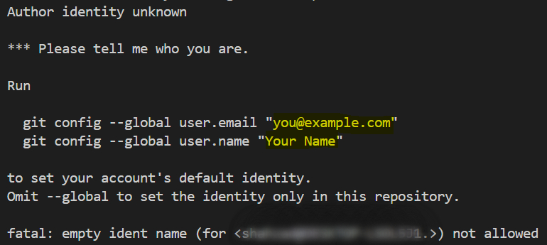
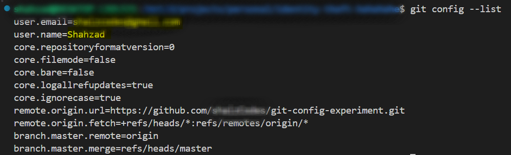
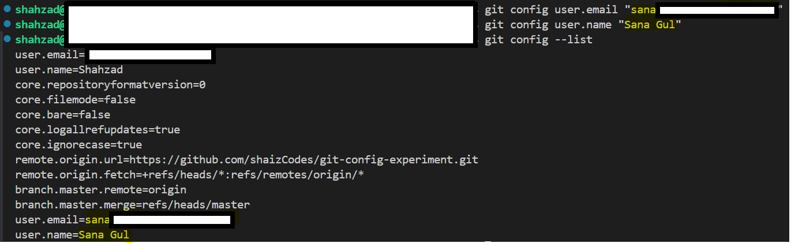

# Git Configuration Experiment

A simple experiment out of curiosity to see what happens when you commit with different git user configurations and then push to GitHub.

## Experiment Flow

1. Add initial screenshots (before any commits)
2. Set git configuration to my original credentials and make some commits
3. Change git configuration to someone else's credentials and make more commits
4. Change git configuration back to my original credentials and make final commits
5. Push all commits to GitHub
6. Screenshot the GitHub repository to see how contributors and commits are attributed

## Setup

Before making commits, configure git with your credentials:

```bash
git config --global user.email "your@example.com"
git config --global user.name "Your Name"
```

If you get an error about empty ident, run the commands above to set your identity:



## Experiment Documentation

### Phase 2: Original Credentials

Configuration set to my actual credentials:



### Phase 3: Different Credentials

Configuration set to someone else' credentials:

> [!NOTE]
> I have taken her consent for this experimentation, and this work is just for educational cause.



### Phase 4: Back to Original
*To be added*

### Phase 5: GitHub Results
*To be added*

## Project Structure

```
/
├── README.md
├── images/
│   ├── 01-initial-setup/          # Screenshots before any commits
│   ├── 02-original-credentials/   # After commits with my original git config
│   ├── 03-different-credentials/  # After commits with different git config
│   ├── 04-back-to-original/       # After commits with original config again
│   └── 05-github-results/         # Screenshots of GitHub showing contributors and commits
└── [experiment files will be added here during the process]
```

## Notes

This is just to understand what happens with local git configuration vs GitHub's attribution system.
